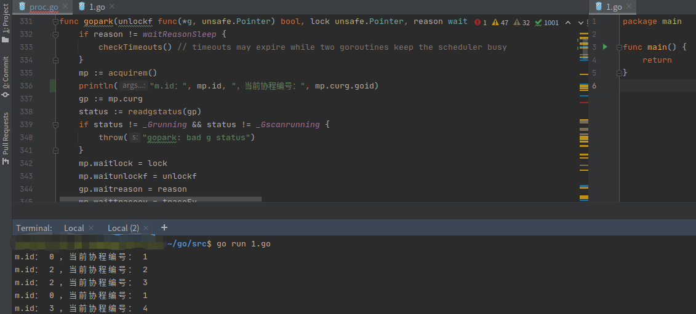

调试源码技巧：

1. 技巧一：使用gdb进行调试
2. 技巧二：直接调试源码
    * 先给源码加权限，`sudo chmod -R 777 当前go源码路径/`
    * 改源码
    * 运行go代码

**实例：**



获取当前协程id：
```go
func GetGID() uint64 {
	b := make([]byte, 64)
	b = b[:runtime.Stack(b, false)]
	fmt.Println(string(b))
	b = bytes.TrimPrefix(b, []byte("goroutine "))
	b = b[:bytes.IndexByte(b, ' ')]
	n, _ := strconv.ParseUint(string(b), 10, 64)
	return n
}
```
其原理是借助runtime包里的Stack方法，获取到当前协程的栈信息，而栈信息里有协程id，将其从里面解析出来，
就可以获取到协程id

或者可以自己在源码中加个方法获取当前协程id，实现如下，测试可行：
```go
// GOROOT/src/runtime/mprof.go
func GetCurrentGoroutineId() int64 {
	curg := getg()
	return curg.goid
}
```
之后在代码中调用
```go
package main

import (
	"fmt"
	"runtime"
)

func main() {
	fmt.Println(runtime.GetCurrentGoroutineId())
}
```